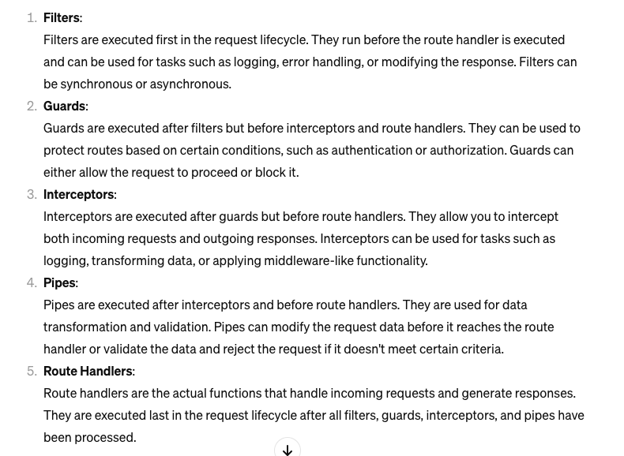
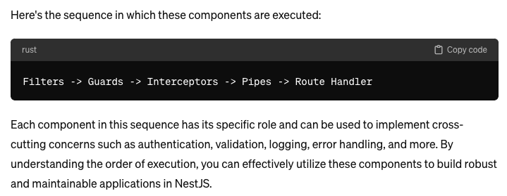
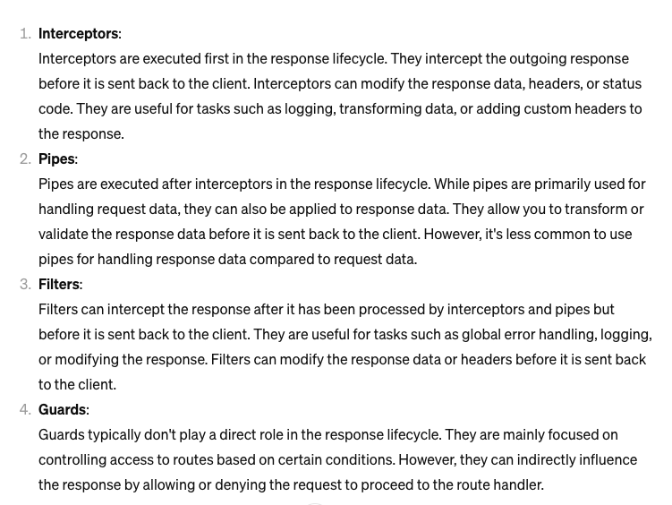
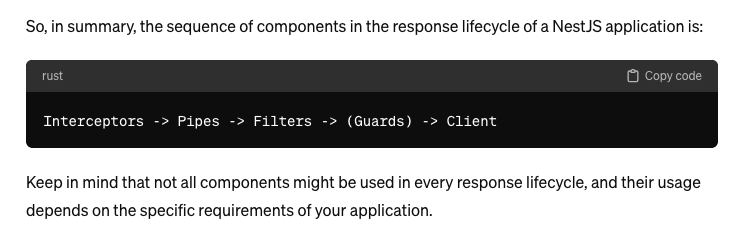

# 简介

    nest.js version 10.0 app

# 说明

    node version: v18.13.0

    npm version:

# 注意

生产环境切换node 版本后需要更新一下pm2: `pm2 update `否则 pm2 使用的 node 仍然是旧的

### 开发环境

    启动项目`yarn start:dev`

### 生产环境

    打包`yarn build`

    打包后更新`pm2 reload <id>`

### nest 常用命令

    生成模块`nest g mo <name>`

    生成控制器`nest g co <name>`

    生成服务`nest g s <name>`

### nest  scope

#### 请求生命周期

#### 响应生命周期

### 文件路径

    log:`  ~/.logs/nestjs_app`

    db:`~/.sqlite`

    shell:`~/.bin/nestjs_app/`
